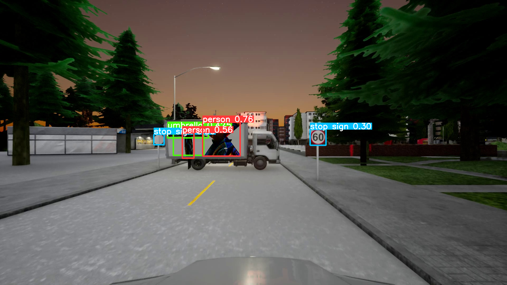

## General Adversarial Attack on Object Detector of Autonomous Driving

### Dataset of autonomous driving
We select 5 different road scenes, place a truck attached which is planing to be attached with our adversarial patch(generated from the public Yolov3 model 1) sideways in the middle of the road and keep it still. We simulate autonomous driving in the Carla simulation platform and extract 240 frames (10s\*24FPS) video which is used to train our adversarial patch in each scene. 

### method
Our idea has two main parts: mask generation and adversarial patch generation.
1. Mask generation
  - Preliminary formation of the mask.
  - Reprocessing of mask.
  - Screening of masks.
2. Adversarial patch generation
  - Adversarial patch processing.
  - Design of loss function.

$x_{adv} = M \odot T_2(\sigma) + (1-M) \odot x$

$ arg \mathop{min_{\sigma}} \mathbb{E}_{x \sim X} [J_{obj} (T_1(x_{adv}), y_{attack})] $

res_2_208.pngres_2_208.png
